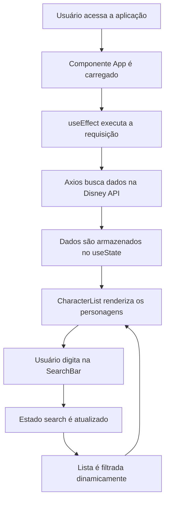
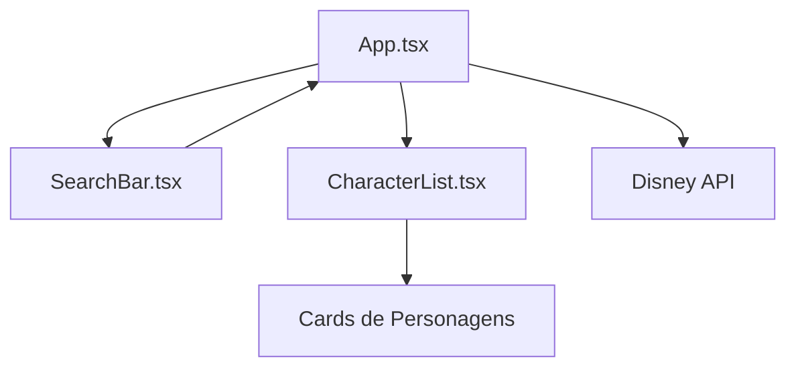
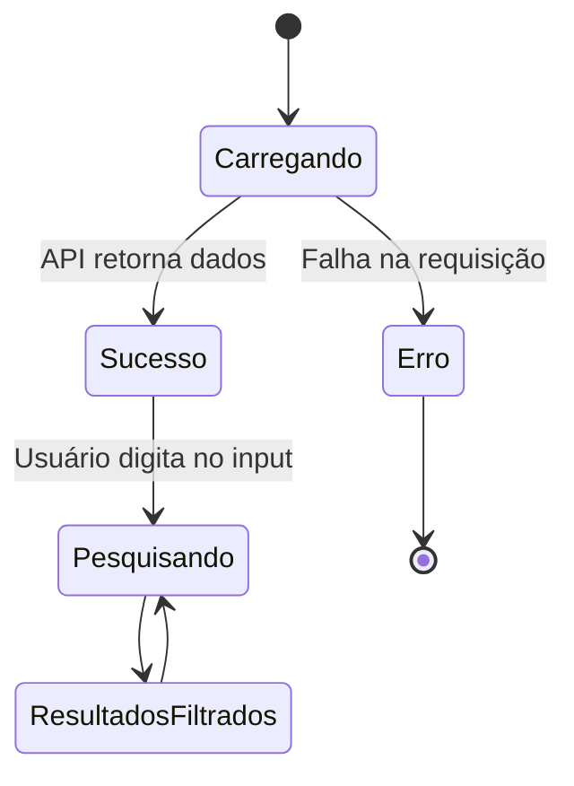

<div align="center">

# 🏰 Disney Characters Explorer


<p>
  Aplicação Front-End desenvolvida em <strong>React</strong> para consumir uma API pública de personagens da Disney, exibindo os dados de forma dinâmica com busca em tempo real.
</p>

<p>
  
  
  
  
</p>

<p>
  
</p>

</div>

---

## ✨ Sobre o Projeto

O **Disney Characters Explorer** é uma aplicação web construída com **React + TypeScript**, utilizando **Axios** para consumir dados de uma API pública.

A proposta principal é exibir personagens da Disney em uma interface simples, moderna e responsiva, permitindo que o usuário pesquise personagens dinamicamente sem recarregar a página.

---

## 🎯 Objetivo da Aplicação

Este projeto foi desenvolvido com foco em praticar conceitos fundamentais de Front-End moderno, como:

- ⚛️ Criação de componentes com React
- 🔎 Barra de pesquisa com input controlado
- 🌐 Consumo de API pública
- 📦 Requisições HTTP com Axios
- 🧠 Gerenciamento de estado com `useState`
- 🔁 Execução de efeitos com `useEffect`
- 🧩 Separação de responsabilidades por componentes
- 🎨 Estilização com CSS
- 📱 Layout responsivo

---

## 🚀 Funcionalidades

| Funcionalidade | Descrição |
|---|---|
| 🏰 Listagem de personagens | Exibe personagens retornados pela API da Disney |
| 🔎 Pesquisa dinâmica | Filtra personagens conforme o usuário digita |
| ⚡ Interface reativa | Atualiza os resultados sem recarregar a página |
| 🖼️ Imagens dos personagens | Mostra imagem do personagem quando disponível |
| 🎬 Informações extras | Exibe filmes e séries relacionados ao personagem |
| ⏳ Estado de carregamento | Mostra mensagem enquanto os dados são buscados |
| ⚠️ Tratamento de erro | Exibe mensagem caso a API não carregue corretamente |
| 📱 Responsividade | Layout adaptado para diferentes tamanhos de tela |

---

## 🧠 Como a Aplicação Funciona



---

## 🧩 Arquitetura dos Componentes



---

## 🛠️ Tecnologias Utilizadas

| Tecnologia | Função |
|---|---|
| ⚛️ React | Construção da interface |
| 🟦 TypeScript | Tipagem estática |
| ⚡ Vite | Ambiente de desenvolvimento rápido |
| 🌐 Axios | Consumo da API |
| 🎨 CSS | Estilização da aplicação |
| 🧪 ESLint | Padronização e análise de código |

---

## 🌐 API Utilizada

A aplicação consome dados da **Disney API**, uma API pública que disponibiliza informações sobre personagens, filmes, séries e outros conteúdos relacionados ao universo Disney.

```ts
https://api.disneyapi.dev/character
```

Exemplo de dados utilizados na aplicação:

```ts
type Character = {
  _id: number;
  name: string;
  imageUrl?: string;
  films: string[];
  tvShows: string[];
};
```

---

## 📁 Estrutura do Projeto

```bash
s1_r2_at2/
├── public/
├── src/
│   ├── assets/
│   ├── components/
│   │   ├── CharacterList.tsx
│   │   └── SearchBar.tsx
│   ├── App.css
│   ├── App.tsx
│   ├── index.css
│   └── main.tsx
├── .gitignore
├── eslint.config.js
├── index.html
├── package.json
├── tsconfig.app.json
├── tsconfig.json
├── tsconfig.node.json
└── vite.config.ts
```

---

## 📌 Principais Componentes

### 🧠 `App.tsx`

Componente principal da aplicação.

Responsável por:

- Controlar os estados da aplicação
- Fazer a requisição para a API
- Armazenar os personagens
- Controlar o texto digitado na busca
- Filtrar os resultados
- Renderizar os componentes principais

---

### 🔎 `SearchBar.tsx`

Componente responsável pela barra de pesquisa.

Ele recebe:

```ts
value: string;
onChange: (value: string) => void;
```

Esse componente permite que o input seja controlado pelo React, atualizando o estado conforme o usuário digita.

---

### 🏰 `CharacterList.tsx`

Componente responsável por exibir os personagens.

Ele recebe uma lista de personagens e renderiza cards contendo:

- Imagem
- Nome
- Filmes
- Séries

Caso nenhum personagem seja encontrado, exibe uma mensagem informando que não há resultados.

---

## 📊 Fluxo de Estados



---

## 📈 Visão Geral do Repositório

<div align="center">


</div>

---

## ⚙️ Como Executar o Projeto

### 1. Clone o repositório

```bash
git clone https://github.com/iannxz/s1_r2_at2.git
```

### 2. Acesse a pasta do projeto

```bash
cd s1_r2_at2
```

### 3. Instale as dependências

```bash
npm install
```

### 4. Execute o projeto

```bash
npm run dev
```

### 5. Acesse no navegador

```bash
http://localhost:5173
```

---

## 📜 Scripts Disponíveis

| Comando | Descrição |
|---|---|
| `npm run dev` | Inicia o servidor de desenvolvimento |
| `npm run build` | Gera a versão de produção |
| `npm run preview` | Visualiza a versão de produção localmente |
| `npm run lint` | Executa a análise do código com ESLint |

---

## ✅ Requisitos Atendidos

| Requisito | Status |
|---|---|
| Componente principal da página | ✅ |
| Componente para exibição da lista | ✅ |
| Barra de pesquisa | ✅ |
| Input controlado | ✅ |
| Consumo de API pública | ✅ |
| Uso de Axios | ✅ |
| Uso de `useState` | ✅ |
| Uso de `useEffect` | ✅ |
| Exibição dinâmica dos dados | ✅ |
| Filtro em tempo real | ✅ |
| Campo textual usado no filtro | ✅ Nome do personagem |
| Tratamento de carregamento | ✅ |
| Tratamento de erro | ✅ |

---

## 🖼️ Prévia da Interface

> Adicione aqui um print do projeto rodando.

```bash
public/preview.png
```

Depois, use:

```md

```

---

## 💡 Possíveis Melhorias Futuras

- ⭐ Adicionar favoritos
- 📄 Criar paginação de personagens
- 🎭 Exibir mais detalhes ao clicar em um personagem
- 🔎 Adicionar filtros por filme ou série
- 🌙 Criar botão manual de tema claro/escuro
- 🚀 Fazer deploy do projeto
- 🧪 Adicionar testes automatizados
---

<div align="center">

### 🏰 Projeto desenvolvido com React, TypeScript e magia Disney ✨


</div>
